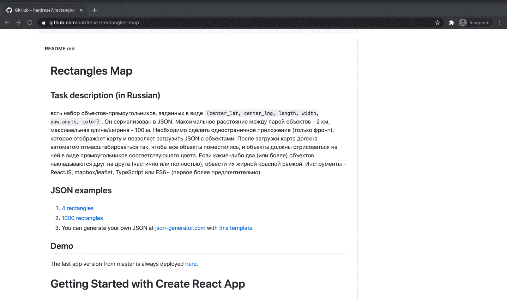

# Rectangles Map

## Task description (in Russian)
есть набор объектов-прямоугольников, заданных в виде `{center_lat, center_lng, length, width, yaw_angle, color}`. Он сериализован в JSON. Максимальное расстояние между парой объектов - 2 км, максимальная длина/ширина - 100 м. Необходимо сделать одностраничное приложение (только фронт), которое отображает карту и позволяет загрузить JSON с объектами. После загрузки карта должна автоматом отмасштабироваться так, чтобы все объекты поместились, и объекты должны отрисоваться на ней в виде прямоугольников соответствующего цвета. Если какие-либо два (или более) объектов накладываются друг на друга (частично или полностью), обвести их жирной красной рамкой. Инструменты - ReactJS, mapbox/leaflet, TypeScript или ES6+ (первое более предпочтительно)

## JSON examples
1. [4 rectangles](https://raw.githubusercontent.com/hardrese7/rectangles-map/master/json-examples/4-rectangles.json) 
1. [1000 rectangles](https://raw.githubusercontent.com/hardrese7/rectangles-map/master/json-examples/1000-rectangles.json)
1. You can generate your own JSON at [json-generator.com](https://www.json-generator.com/) with [this template](https://raw.githubusercontent.com/hardrese7/rectangles-map/master/json-examples/json-generator.com.template)

## Demo
The last app version from master is always deployed [here](https://rectangles-map.netlify.app/).

## Project setup and run
1. Clone the project
1. Open project root in terminal
1. Install dependencies with yarn: `yarn`
1. Run the application in the development mode: `yarn start`
1. Open [http://localhost:3000](http://localhost:3000) to view it in the browser
1. Or build the project for the production: `yarn build`

## Project TODOs
1. Show errors with toasts, instead of alerts
1. Implement unit-tests
1. Implement e2e tests
1. Fix todos in the code
1. Check different browsers and devices support(now it was tested only in Chrome/MacOS)

## Getting Started with Create React App

This project was bootstrapped with [Create React App](https://github.com/facebook/create-react-app).

## Learn More

You can learn more in the [Create React App documentation](https://facebook.github.io/create-react-app/docs/getting-started).

To learn React, check out the [React documentation](https://reactjs.org/).
